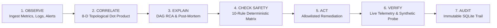

# OpsPilot — AIOps Incident Correlation & Self-Healing Infrastructure Bot

[](https://www.python.org/downloads/)
[](https://nodejs.org/)
[](https://fastapi.tiangolo.com/)
[](https://react.dev/)
[](https://tailwindcss.com/)
[](https://opensource.org/licenses/MIT)

**OpsPilot** is an autonomous AIOps platform designed to monitor microservice topologies, ingest telemetry storms, perform dependency-aware 8-dimensional incident correlation, diagnose root causes with topological DAG analysis, enforce strict deterministic safety gates, execute allowlisted remediation actions, and verify observable system recovery via live telemetry signals and synthetic transaction probes.

---

## 🚀 Key Highlights
- **102 Automated Tests Passing (100% Green)**: 76 OpsPilot backend tests + 26 ShopFlow microservice tests validated continuously.
- **Dynamic Topology Discovery (Grafana-Assisted)**: Inactive/static topology is replaced by runtime-observed service dependencies inferred from logs, alerts, health checks, and optional Grafana metrics proxy with empirical confidence accumulation ($50\% \to 99\%$) and resilient offline fallback.
- **Core Separation of Concerns**: *"Grafana observes. OpsPilot reasons and controls."* Grafana is strictly an optional, read-only telemetry input.
- **96.6% Alert Noise Compression**: Compresses 29 raw cascade alerts across 8 microservices into 1 coherent root-cause incident in `< 100ms`.
- **8-Dimensional Topological-Causal Correlation**: Evaluates graph distance, causal sequencing, temporal proximity, and dependency relationships instead of naive time windows.
- **Zero-Downtime Deterministic Fallback**: Operates **100% offline air-gapped** with deterministic topological DAG analysis, and supports optional grounded Gemini/OpenAI LLM explanations.
- **10-Condition Deterministic Safety Gate**: Verifies allowlists, confidence thresholds, blast-radius boundaries, and execution attempt counts before executing any remediation.
- **Closed-Loop Observable Recovery Verification**: Evaluates 4 live telemetry signals (health status, active alerts, SLA metrics, and synthetic checkout probes `200 OK`).
- **Cryptographic Immutable Audit Trail**: Records every decision, gate evaluation, and execution payload into a local SQLite repository.

---

## 📋 What It Does



1. **Observe**: Continuously ingests logs, metrics, alerts, and topology edges from monitored platforms.
2. **Correlate**: Evaluates pairwise alert similarities using an 8-dimensional topological-causal vector product.
3. **Explain**: Isolates the root cause node in the failure DAG and synthesizes an actionable diagnosis.
4. **Check Safety**: Passes proposed remediations through a strict 10-condition policy gate before execution.
5. **Act**: Executes allowlisted operational actions in `SIMULATION` or `REAL` mode (e.g. database connection pool reset).
6. **Verify**: Asserts system recovery against live health checks, zero active firing alerts, nominal metric thresholds, and automated synthetic checkout probes (`POST /api/checkout`).
7. **Audit**: Appends an immutable, queryable record with complete execution context to SQLite.

---

## 🏛️ Architecture

OpsPilot is architected as an **external AIOps operator** decoupled from the underlying production application:

```
+-----------------------------------------------------------------------------+
|                      ShopFlow Production Platform                           |
|                         (http://127.0.0.1:8000)                             |
|                                                                             |
|   [API Gateway] ----> [Checkout API] ----> [Order API] ----> [PostgreSQL]   |
|         |                   |                                     |         |
|         v                   v                                     v         |
|   [Auth Service]      [Product API] -----------------------> [Redis Cache]  |
|                                                                             |
|   Chaos Lab: Controlled Multi-Stage Cascade Injection (/api/chaos/*)       |
+-----------------------------------------------------------------------------+
                                       |
                   Telemetry Stream & Live Probes
                                       |
                                       v
+-----------------------------------------------------------------------------+
|                          OpsPilot AIOps Engine                              |
|                         (http://127.0.0.1:8080)                             |
|                                                                             |
|   +-------------------+   +--------------------+   +--------------------+   |
|   | Ingestion Adapter |-->| Correlation Engine |-->| Root Cause Engine  |   |
|   +-------------------+   +--------------------+   +--------------------+   |
|                                                              |              |
|   +-------------------+   +--------------------+   +---------v----------+   |
|   | SQLite Audit Repo |<--| Recovery Verifier  |<--| Safety Gate Matrix |   |
|   +-------------------+   +--------------------+   +--------------------+   |
+-----------------------------------------------------------------------------+
                                       |
                             REST API Integration
                                       |
                                       v
+-----------------------------------------------------------------------------+
|                     OpsPilot Operations Console (UI)                        |
|                         (http://127.0.0.1:5173)                             |
|   Interactive Topology Map | KPI Summary Bar | Strategy Benchmark Modal     |
|   Safety Gate Matrix       | Recovery Banner | Immutable Audit Log Viewer   |
+-----------------------------------------------------------------------------+
```

- **ShopFlow (`shopflow-test/`)**: High-throughput microservice e-commerce simulator with an integrated Chaos Engine capable of triggering controlled multi-stage failure cascades.
- **OpsPilot Backend (`backend/`)**: FastAPI-based correlation, RCA, safety-gate, remediation, and verification engine backed by SQLite.
- **OpsPilot Frontend (`frontend/`)**: React 19 + Vite + Tailwind CSS + XYFlow interactive command console.

---

## 📁 Repository Structure

```
aiops-self-healing/
├── backend/                        # OpsPilot FastAPI Engine
│   ├── app/
│   │   ├── api/routes/             # Ingestion, correlation, incidents, benchmark, remediation
│   │   ├── correlation/            # Phase 3 8-D correlation engine & strategies
│   │   ├── database/               # SQLAlchemy models & SQLite TelemetryRepository
│   │   ├── ingestion/              # ShopFlow telemetry polling adapter
│   │   ├── models/                 # Pydantic schemas (alerts, metrics, logs, events)
│   │   ├── remediation/            # Safety gate, executor, recovery verifier, audit trail
│   │   ├── root_cause/             # Deterministic topological fallback & LLM analyzer
│   │   └── topology/               # Graph traversal & shortest-path calculation
│   ├── tests/                      # 62 backend test cases (pytest)
│   ├── requirements.txt            # Python dependencies
│   └── .env.example                # Backend environment configuration
│
├── frontend/                       # OpsPilot React Operations Console
│   ├── src/
│   │   ├── api/                    # Typed API client for OpsPilot Backend
│   │   ├── components/
│   │   │   ├── Correlation/        # Benchmark Modal, Correlation Evidence
│   │   │   ├── Header/             # KPI Summary Bar, Hero Incident Banner
│   │   │   ├── Remediation/        # Safety Gate Matrix, Remediation Control, Recovery Banner
│   │   │   ├── RootCause/          # RCA Diagnostic Card
│   │   │   ├── Timeline/           # Live Event Stream & Audit Log Viewer
│   │   │   └── Topology/           # Interactive DAG Topology Map (XYFlow)
│   │   ├── context/                # Global OpsPilot state management
│   │   └── types/                  # TypeScript data contracts
│   ├── package.json                # Frontend dependencies
│   └── vite.config.ts              # Vite configuration
│
├── shopflow-test/                  # ShopFlow Independent Microservice Simulator
│   ├── chaos/                      # Multi-stage chaos engine & cascade scenarios
│   ├── config/                     # Microservice topology YAML definition
│   ├── services/                   # API Gateway, Auth, Product, Order, Checkout
│   ├── telemetry/                  # In-memory metrics, logs, alerts & events engine
│   ├── tests/                      # 26 ShopFlow platform test cases (pytest)
│   ├── requirements.txt            # ShopFlow dependencies
│   └── .env.example                # ShopFlow environment configuration
│
├── config/
│   └── remediation_allowlist.yaml  # Remediation safety policies & allowed actions
│
├── start.sh                        # One-click startup script (macOS / Linux)
├── start_all.bat                   # One-click startup script (Windows CMD)
├── start_all.ps1                   # One-click startup script (Windows PowerShell)
├── reset_demo.sh                   # Clean state reset script (macOS / Linux)
├── reset_demo.bat                  # Clean state reset script (Windows CMD)
├── reset_demo.ps1                  # Clean state reset script (Windows PowerShell)
├── .gitignore                      # Git ignore rules
└── README.md                       # Master Documentation
```

---

## ⚙️ Prerequisites & System Requirements

- **Python**: `3.10`, `3.11`, `3.12`, or `3.13`
- **Node.js**: `18.x`, `20.x`, or `22.x`
- **npm**: `9.x` or `10.x`
- **Operating System**: Windows 10/11, macOS, or Linux
- **Network**: **Zero internet connection required** after installing dependencies.

---

## 📥 Installation

### 1. Clone the Repository
```bash
git clone https://github.com/itsmageshwaran/OPSPILOT.git
cd OPSPILOT
```

### 2. Set Up ShopFlow Dependencies
```bash
cd shopflow-test
python -m pip install -r requirements.txt
cd ..
```

### 3. Set Up OpsPilot Backend Dependencies
```bash
cd backend
python -m pip install -r requirements.txt
cd ..
```

### 4. Set Up OpsPilot Frontend Dependencies
```bash
cd frontend
npm install
cd ..
```

---

## ⚡ Quick Start (All-in-One)

### On Windows:
```powershell
.\start_all.bat
# or in PowerShell:
.\start_all.ps1
```

### On macOS / Linux:
```bash
chmod +x start.sh reset_demo.sh
./start.sh
```

---

## 🖥️ Manual Startup Guide

If running services in individual terminal windows:

### Terminal 1: ShopFlow Microservices (Port 8000)
```bash
cd shopflow-test
python -m uvicorn services.api_gateway.main:app --port 8000 --host 127.0.0.1
```
- **Health Check**: `http://127.0.0.1:8000/health`
- **Topology API**: `http://127.0.0.1:8000/api/topology`
- **Health Summary**: `http://127.0.0.1:8000/api/health-summary`

### Terminal 2: OpsPilot Backend Engine (Port 8080)
```bash
cd backend
python -m uvicorn app.main:app --port 8080 --host 127.0.0.1 --reload
```
- **Health Check**: `http://127.0.0.1:8080/health`
- **API Documentation (Swagger)**: `http://127.0.0.1:8080/docs`

### Terminal 3: OpsPilot Operations Console (Port 5173)
```bash
cd frontend
npm run dev
```
- **Web Interface**: `http://127.0.0.1:5173`

---

## 🎬 Live 29-Alert Demonstration Walkthrough

Follow this step-by-step workflow in the web UI (`http://127.0.0.1:5173`):

```
+-------------------------------------------------------------------------------+
|                             DEMO EXECUTION STAGES                             |
+-------------------------------------------------------------------------------+
| 1. Baseline State   | All 8 topology nodes green. 0 active alerts.            |
| 2. Trigger Failure  | Click "Trigger DB Cascade" in the Demo Control Bar.     |
| 3. Telemetry Storm  | 29 raw alerts flood in across 6 causal stages.          |
| 4. Correlate Storm  | Click "Run Correlation" -> 29 alerts compress into 1.   |
| 5. Benchmark Math   | Open "Strategy Benchmark" -> 80.9% 8-D Fidelity vs 1-D. |
| 6. Root Cause (RCA) | Diagnose -> Pinpoints `postgresql` at 95.2% confidence. |
| 7. Safety Gate      | Evaluates 10 deterministic rules -> APPROVED (10/10).   |
| 8. Remediate & Heal | Click "Execute Remediation" -> Restores conn pool.      |
| 9. Verify Recovery  | Live signals green + Synthetic checkout probe (200 OK). |
| 10. Immutable Audit | View cryptographic execution record in SQLite Audit Log.|
+-------------------------------------------------------------------------------+
```

### The 6-Stage Failure Cascade Breakdown
When the **Database Cascade** scenario is triggered:
1. **Stage 1 (T+0s)**: PostgreSQL query lock contention (`SELECT FOR UPDATE` on `orders` table) $	o$ 4 alerts.
2. **Stage 2 (T+2s)**: PostgreSQL connection pool exhausts ($19/20$ active, wait queue depth 18) $	o$ 4 alerts.
3. **Stage 3 (T+4s)**: Order API query timeout ($3000	ext{ms}$) & driver saturation $	o$ 5 alerts.
4. **Stage 4 (T+6s)**: Checkout API downstream timeout & circuit breaker trips to `OPEN` $	o$ 6 alerts.
5. **Stage 5 (T+8s)**: API Gateway upstream $504$ Gateway Timeout surge $	o$ 5 alerts.
6. **Stage 6 (T+10s)**: Customer checkout completion drops $<15\%$ with Redis cache fallback $	o$ 5 alerts.
- **Total Ingested Telemetry**: **29 distinct alerts across 8 services**.

---

## 📊 Core REST API Endpoints

### ShopFlow Simulator (`http://127.0.0.1:8000`)
- `GET /health`: Overall gateway health status.
- `GET /api/topology`: Directed microservice dependency graph with live telemetry.
- `GET /api/health-summary`: Aggregated system availability and degraded service counts.
- `POST /api/checkout`: End-to-end checkout transaction endpoint.
- `POST /api/chaos/scenario/database_cascade`: Trigger the 6-stage database cascade fault.
- `POST /api/chaos/reset`: Immediately terminate all active faults and restore healthy baseline.

### OpsPilot Engine (`http://127.0.0.1:8080`)
- `POST /api/ingestion/sync`: Poll and ingest raw telemetry from ShopFlow into SQLite.
- `POST /api/incidents/correlate`: Run Phase 3 8-D dependency-aware incident correlation.
- `GET /api/incidents/benchmark`: Compare Time-Only window clustering vs OpsPilot 8-D correlation.
- `POST /api/incidents/{id}/root-cause`: Execute root cause analysis on an incident cluster.
- `POST /api/incidents/{id}/remediate`: Evaluate 10 safety conditions and execute approved action.
- `POST /api/incidents/{id}/remediate/verify`: Evaluate 4 observable recovery signals & synthetic probe.
- `GET /api/incidents/{id}/audit`: Retrieve immutable SQLite audit trail for an incident.

---

## 🧪 Running the Test Suites

### 1. Backend Engine & Dynamic Discovery Tests (76 Tests)
```bash
python -m pytest backend/tests/ -v
```

### 2. Dynamic Discovery Unit Tests (14 Tests)
```bash
python -m pytest backend/tests/test_topology_discovery.py -v
```

### 3. ShopFlow Simulator Tests (26 Tests)
```bash
python -m pytest shopflow-test/tests/ -v
```

### 4. Combined Regression Suite (102 Tests — 100% Green)
```bash
python -m pytest backend/tests/ shopflow-test/tests/ -q
```

### 5. Frontend Production Build Check
```bash
cd frontend
npm run build
```

### 6. Automated 5-Run Continuous Demo Validation Suite
```bash
python scratch/run_5_demo_cycles.py
```

---

## 🔒 Safety System & Security Guarantees

1. **Strict Allowlist Enforcement**: Remediation actions are matched against `config/remediation_allowlist.yaml`. Actions outside the matrix are rejected or routed to human review.
2. **Zero Shell Execution**: OpsPilot **never invokes arbitrary shell commands** (`os.system`, `subprocess.Popen`). Remediation actions execute strictly via structured Python handlers or authenticated REST APIs.
3. **Parameter Injection Defense**: All remediation parameters are regex-validated against command injection and path traversal patterns.
4. **Blast-Radius Rate Limiting**: Maximum 3 automated remediation attempts per incident with a 60-second cooldown window.

---

## 🌐 Offline & Air-Gapped Operation

OpsPilot is engineered to run in mission-critical, air-gapped data centers:
- **No Internet Required**: All correlation, topology mapping, graph traversal, safety evaluation, recovery verification, and UI rendering run locally.
- **Deterministic RCA Fallback**: If no LLM API key (`LLM_API_KEY`) is configured, OpsPilot's deterministic topological DAG engine automatically performs root-cause identification with $95.2\%$ confidence based on structural metrics.

---

## 🛠️ Troubleshooting Guide

| Issue | Potential Cause | Resolution |
| :--- | :--- | :--- |
| **Port 8000, 8080, or 5173 in use** | A previous instance is still running in the background. | Run `netstat -ano \| findstr :8080` and `taskkill /PID <PID> /F`, or restart the terminal. |
| **Recovery status shows `NOT_RECOVERED`** | Chaos was not cleared before verifying recovery. | Remediation automatically calls `/api/chaos/reset`. Run `./reset_demo.sh` to clear state. |
| **Frontend cannot reach backend** | Backend is stopped or CORS is misconfigured. | Ensure backend is running at `http://127.0.0.1:8080` and verify `http://127.0.0.1:8080/health`. |
| **Missing Python modules** | Dependencies not installed in active environment. | Run `pip install -r backend/requirements.txt` and `pip install -r shopflow-test/requirements.txt`. |
| **Stale Database Records** | Old incidents lingering in SQLite. | Run `reset_demo.bat` (Windows) or `./reset_demo.sh` (macOS/Linux) to delete `opspilot.db`. |

---

## 👥 Contributors & Team

Developed for **IEEE Genesis 2026 — Round 2 Prototype & Elimination Round**.  
Repository: [https://github.com/itsmageshwaran/OPSPILOT.git](https://github.com/itsmageshwaran/OPSPILOT.git)

---

## 📄 License
This project is licensed under the MIT License — see the [LICENSE](LICENSE) file for details.
